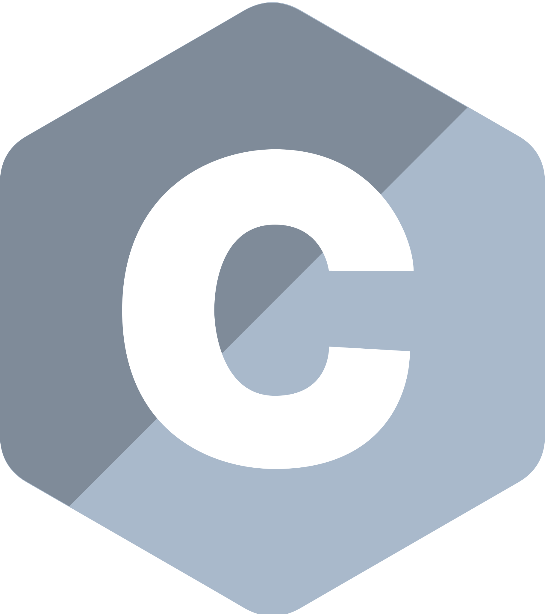

  

<h1 align="center"> 
  
</h1>

  Hi, I'm Ghezal Amine, a Software Developer and aspiring Data Engineer from Algeria.
    

- 🔬 I'm currently pursuing a Master's degree in Computer Science at Biskra University

- 🎓 I graduated from Biskra University, Department of Computer Science, with a Licence degree

- 🎓 I graduated from Rachid Reda El-Achouri High School

- 💻 I work on software development, data analysis, machine learning, Python, web, mobile projects

- 📊 I'm currently focusing more on Data Engineering and data-related projects

- 📫 How to reach me: **ghhezal@gmail.com**

<h3 align="center">⭐Languages & Tools & Abilities⭐</h3>
 

  <code></code>
  <code></code>
  <code></code>
  <code></code>
  <code></code>
  <code></code>
  <code></code>
  <code></code>
  <code></code>
  <code></code>
  <code></code>
  <code></code>
  <code></code>
  <code></code>
  <code></code>
  <code></code>
  <code></code>

<h3 align="center">⭐Stats⭐</h3>

  

    
  

    
  

